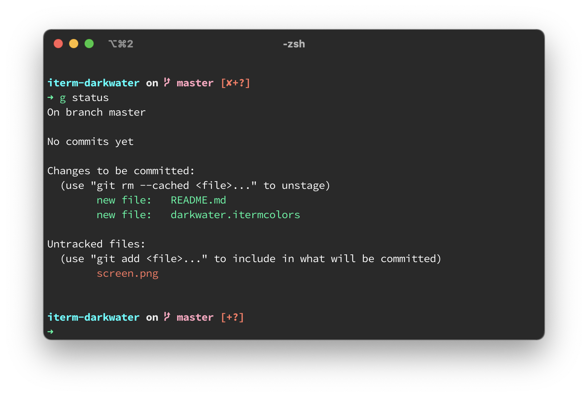

# Darkwater color scheme for iTerm2

This is a porting to iTerm 2 of [johnpmorris/hyperterm-darkwater](https://github.com/johnpmorris/hyperterm-darkwater)

## Install using Git

If you are a git user, you can install the theme and keep up to date by cloning the repo:

    git clone https://github.com/dracula/iterm.git

## Install manually

Download using the [GitHub .zip download](https://github.com/slackerzz/iterm-darkwater/archive/master.zip) option and unzip them.

### Activating theme

1.  _iTerm2 > Preferences > Profiles > Colors Tab_
2.  Open the _Color Presets..._ drop-down in the bottom right corner
3.  Select _Import..._ from the list
4.  Select the `darkwater.itermcolors` file
5.  Select the _darkwater_ from _Color Presets..._
